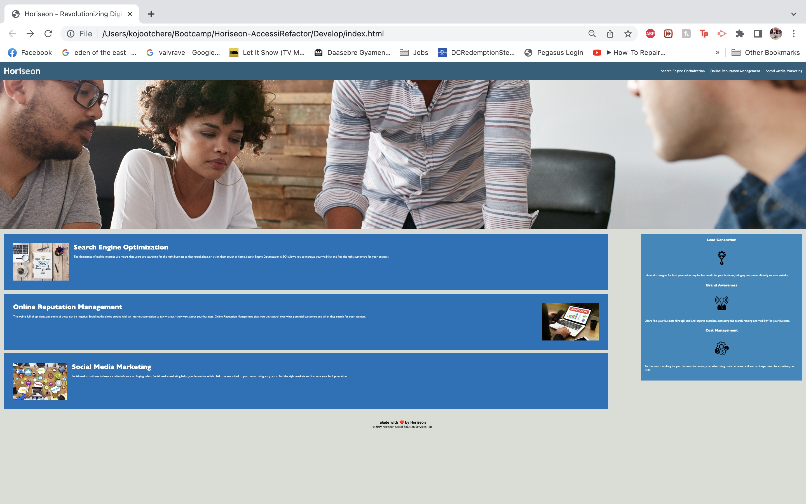

# Horiseon Social Solution Services, Inc.

## Description

Horiseon is a marketing agency that offers a variety of services to businesses. Our services include search engine optimization, online reputation management, and social media marketing. These services are designed to increase your visibility, control your online presence, and drive more customers to your business through online platforms.

In this project, we revamped the Horiseon website to improve accessibility, which is crucial for businesses in this digital age. We achieved this by implementing semantic HTML elements, ensuring all images had alt attributes, and improving the overall structure and design of the CSS file.

This project is an excellent demonstration of a well-structured HTML and CSS file. Both beginners and experienced developers can gain valuable insights from this project on how to structure HTML elements semantically and organize CSS selectors and properties effectively.

## Screenshot

## Link to the Deployed Application

Link to Deployed Application: https://kojootchere.github.io/Horiseon-AccessiRefactor/

## Contact Information

For more information about Horiseon and the services we offer, please visit our website or contact us directly. We look forward to helping you boost your online presence.

Email: info@horiseon.com  
Phone: (123) 456-7890
